# Taskly - Akıllı Görev ve Alışkanlık Yöneticisi

**Taskly**, kullanıcıların görevlerini ve alışkanlıklarını takip etmelerini, düzenlemelerini ve hatırlatmalarla motive olmalarını sağlayan bir Android uygulamasıdır. Uygulama, modern Android teknolojilerini kullanarak sıfırdan geliştirilmiştir ve tamamen kullanıcı dostu bir arayüzle tasarlanmıştır.

## Özellikler

### Görevler
- **Görev Oluşturma**: Haftalık, aylık, günlük ya da tek seferlik görevler oluşturabilirsiniz.
- **Bildirimler**: Görev başlangıcı, tamamlanma ve ilerleme bildirimleriyle sürekli bilgilendirilirsiniz. Görev öncesi hatırlatıcılar, belirlediğiniz saatte bildirim gönderir.
- **Alt Görevler**: Ana görevler için alt görevler oluşturabilir ve ilerlemenizi daha ayrıntılı şekilde takip edebilirsiniz.
- **Motivasyon Bildirimleri**: Günlük olarak size motivasyon sözleri bildirim olarak gönderilir.
- **Görev Durumu**: Görevlerinizi "başlandı", "devam ediliyor" ve "tamamlandı" gibi durumlarla takip edebilirsiniz.
- **Zamanlama Ayarları**: Görev öncesi bildirim zamanını ayarlayabilir ve bildirimin sesini açıp kapatabilirsiniz.
- **Görev Öncesi Hatırlatıcılar**: Eğer o gün görev yapılmamışsa, düzenli aralıklarla hatırlatıcı bildirimleri alırsınız.
- **Ana Sayfa**: Günlük görevlerinizi ve kalan zamanınızı ana sayfada kolayca takip edebilirsiniz.

### Alışkanlıklar
- **Alışkanlık Takibi**: Düzenli olarak yapmanız gereken alışkanlıkları oluşturabilir ve takip edebilirsiniz.
- **Hatırlatıcılar**: Bir alışkanlık uzun süre yapılmazsa, hatırlatıcı bildirim gönderilir.
- **Veriler ve İstatistikler**: Alışkanlıklarınızın sıklığını, başarı oranlarını ve genel ilerlemenizi grafiklerle takip edebilirsiniz.
- **Başarılar ve Puanlama**: Alışkanlıklarınızı takip ederken başarımlar kazanabilirsiniz.

### Yedekleme ve Veri Koruma
- **Veri Yedekleme**: Kullanıcı verileri düzenli olarak yedeklenebilir, böylece veri kaybı riski ortadan kaldırılır. 
- **Veri Güvenliği**: Uygulama, kullanıcı verilerini güvenli bir şekilde saklar ve yalnızca yetkilendirilmiş kişiler tarafından erişilebilir olmasını sağlar.

### İleri Düzey Özellikler
- **Takvim**: Görev ve alışkanlıklarınızı takvim üzerinde takip edebilir, tarihleri işaretleyebilir ve notlar ekleyebilirsiniz.
- **İstatistikler**: Alışkanlıklarınızın sıklığı, başarı oranları ve diğer veriler grafiklerle görselleştirilir.

## Kullanılan Teknolojiler

- **Jetpack Compose**: Modern Android UI aracı olan Jetpack Compose ile uygulama sıfırdan geliştirilmiştir.
- **Room Database**: Verilerinizi güvenli bir şekilde saklamak için Room veritabanı kullanıldı.
- **Broadcast Receiver ve Bildirimler**: Görev ve alışkanlık hatırlatıcıları için bildirimler Broadcast Receiver ile yönetilmektedir.

## Mimari
Uygulama, **MVVM** (Model-View-ViewModel) mimarisi ile geliştirilmiş olup, **Clean Architecture** prensiplerine uygun olarak yapılandırılmıştır. Bu sayede kod bakımı kolay ve esnek hale getirilmiştir.

## Öğrenilenler

- **Jetpack Compose**: Bu projede Jetpack Compose'u kullanarak modern Android uygulamaları geliştirme deneyimi kazandım.
- **Broadcast Receiver ve Bildirimler**: Android'de bildirimleri ve hatırlatıcıları etkin bir şekilde kullanmayı öğrendim.
- **Room Database**: Veritabanı yönetimi ve kalıcı veri saklama yöntemlerini başarıyla uyguladım.
- **MVVM ve Clean Architecture**: Bu uygulamada bu iki mimariyi kullanarak uygulama geliştirme sürecini daha verimli hale getirdim.

## Kullanıcı Deneyimi
Taskly, kullanıcı dostu bir arayüze sahip olup, görev ve alışkanlıkları kolayca takip etmenizi sağlar. Görsel açıdan şık, anlaşılır ve etkili bir kullanıcı deneyimi sunmak için özenle tasarlanmıştır.

## Uygulama Görselleri

- **Ana Sayfa ve Görev Yönetimi**
<p float="left"> 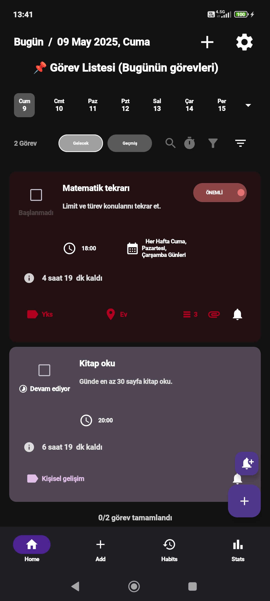 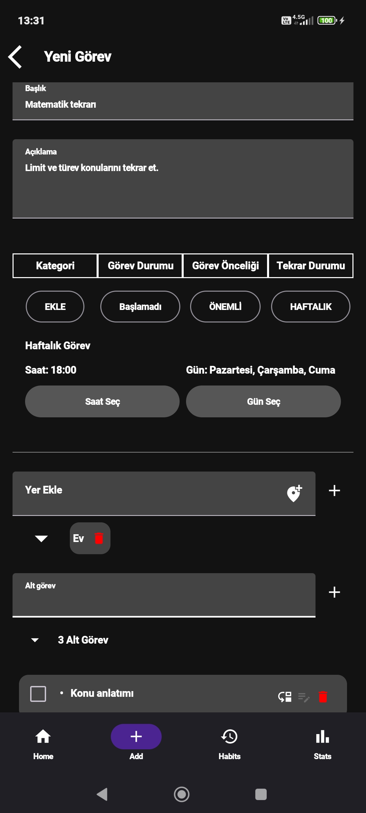 </p>

- **Alışkanlık Listesi ve Oluşturma**
<p float="left"> 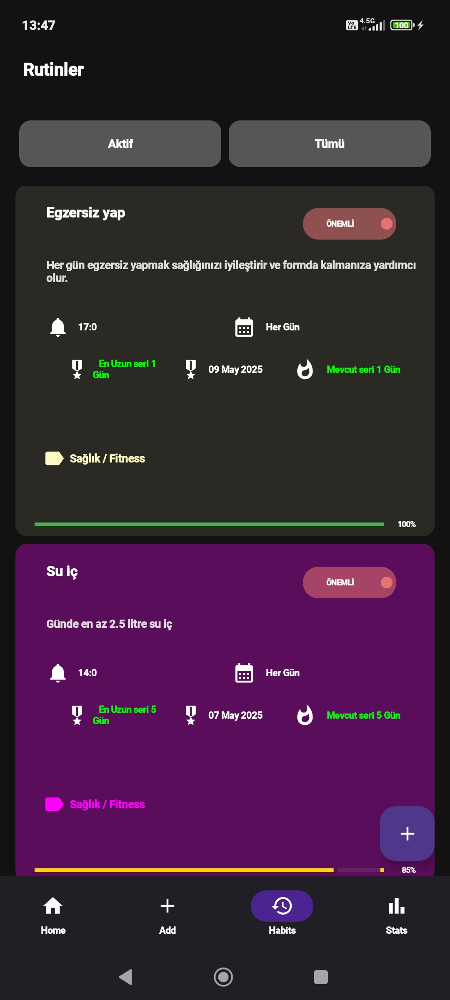 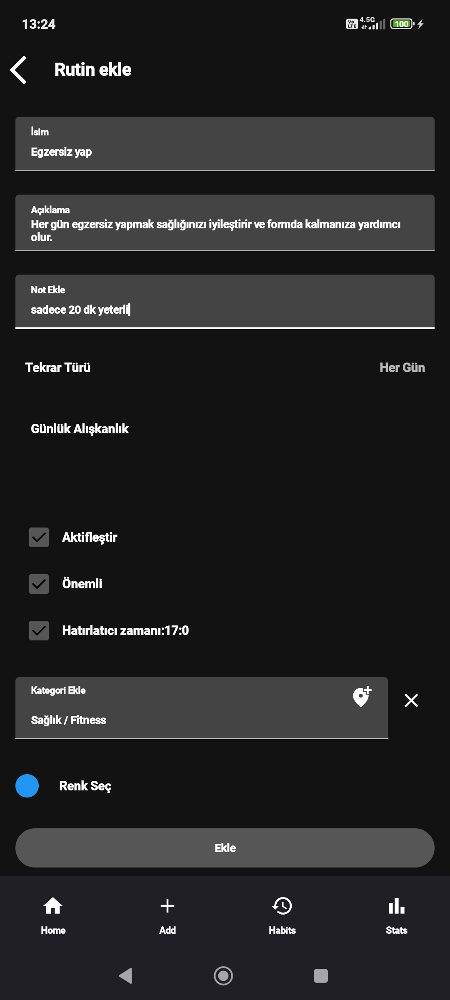 </p>

- **Alışkanlık Takibi ve İstatistikler**
<p float="left"> 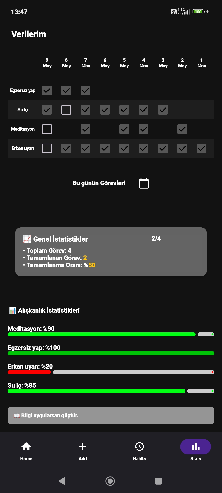 </p>

- **Alışkanlık Detayları ve Analizler**
<p float="left"> 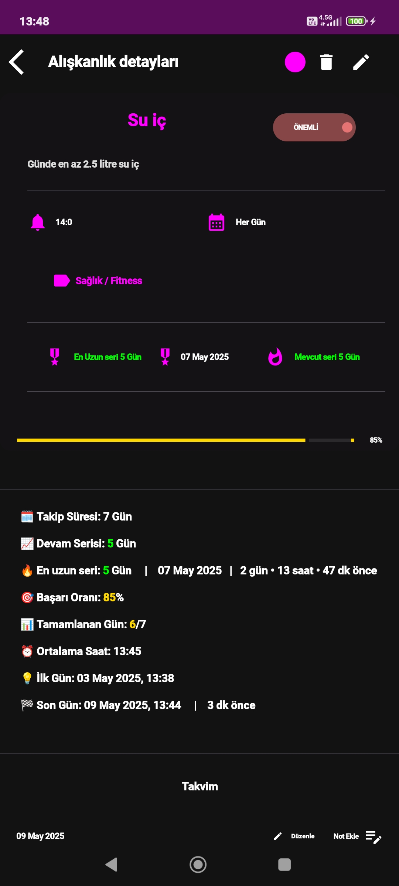 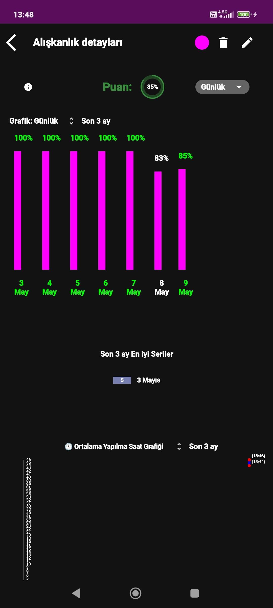 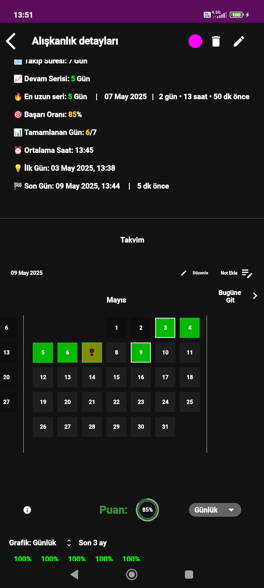 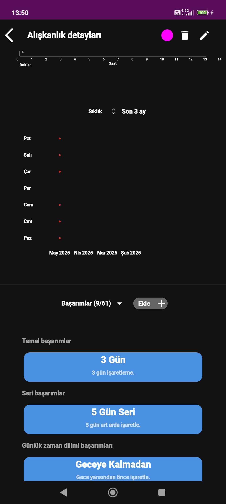 </p>

- **Bildirimler**
  <p float="left"> 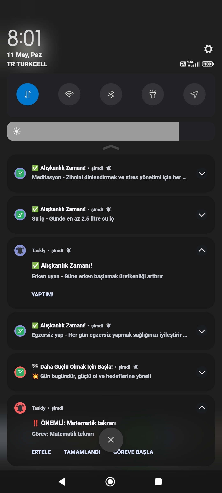 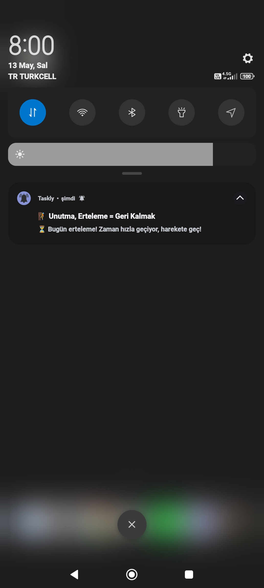 </p>


## 📥 Uygulamayı İndir (APK)


[APK İndir](https://github.com/tanerkaynar2/taskly/releases/download/v1.0/Taskly.apk)

[APK'yı Google Drive üzerinden indir](https://drive.google.com/file/d/1tQs2sQs3dMai5DV-5Q5luXCHa8k2hGBt/view?usp=drive_link)

## Nasıl Çalıştırılır?
1. Repozitoriyi klonlayın:
   ```bash
   git clone https://github.com/tanerkaynar2/taskly.git
   
2. Android Studio'yu açın ve projeyi yükleyin.

3. Uygulamayı bir emülatör veya gerçek cihazda derleyin ve çalıştırın.

---
